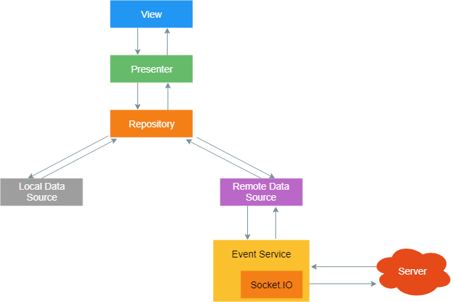
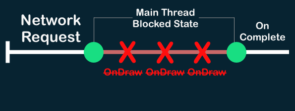

<h1 align="center">Button Game Show App</h1>

<p align="center">  
   Button Game Show App is an application to determine who clicks the button first in a round. It is an imitation of a button from game shows in which one of the most important elements is a duel of players through faster reaction and answering in a given time. The application therefore allows several players to compete and information which of them clicked the button first. Application built with Jetpack (ViewModel, Navigation), Dependency Injection (Koin), Coroutines, Material Design based on MVVM architecture.
</p>

## Game presentation

After enabling the application, the user must select his profile. He can create it or choose from existing ones. After selecting a profile, the user can create a lobby or join an existing one. This is how it looks from the perspective of the lobby administrator.

<p align="center">

</p>

And this is how it looks from the perspective of the user joining the lobby.

<p align="center">

</p>

The game replaces the buttons in the game show for players. When the user presses the button, his nickname changes to red and he receives information about the order in which he clicked on the button. This works similarly to the first-press systems in TV tournaments. Thanks to the game, friends can play mini game shows in a smaller group with high accuracy, without any doubts about who came first.

The app gives you the option to delete a lobby, exit a lobby, or kick a user out of a lobby. Ejecting looks like the following.

<p align="center">

</p>

<p align="center">

</p>

The perspective of the person kicked out.

<p align="center">

</p>

The Button Game Show application enables efficient and interesting competition between friends. The application will soon be available on Google Play.

## Tech stack & Open-source libraries
- Minimum SDK level 26
- [Kotlin](https://kotlinlang.org/) based
- Jetpack
    - Lifecycle: Observe Android lifecycles and handle UI states upon the lifecycle changes.
    - ViewModel: Manages UI-related data holder and lifecycle aware. Allows data to survive configuration changes such as screen rotations.
    - DataBinding: Binds UI components in your layouts to data sources in your app using a declarative format rather than programmatically.
- Architecture
    - [MVVM Architecture](https://github.com/amitshekhariitbhu/MVVM-Architecture-Android) and [UseCase](https://medium.com/@BerkOzyurt/android-clean-architecture-mvvm-usecase-ae1647f0aea3) (View - DataBinding - ViewModel - UseCase - Model)
    - [Bindables](https://github.com/skydoves/bindables): Android DataBinding kit for notifying data changes to UI layers.
    - Repository Pattern
- [Courtines](https://developer.android.com/kotlin/coroutines): A coroutine is a concurrency design pattern that you can use on Android to simplify code that executes asynchronously,
- [Koin](https://insert-koin.io/): Koin is a smart Kotlin dependency injection library to keep you focused on your app,
- [Socket.io](https://socket.io/): Bidirectional and low-latency communication for every platform,
- [Json](https://www.json.org/json-en.html): is a lightweight data-interchange format.

## Architecture
**Button Game Show App** is based on the MVVM architecture, UseCase architecture and the Repository pattern, which follows the [Google's official architecture guidance](https://developer.android.com/topic/architecture).


### Architecture Overview


- Each layer follows [unidirectional event/data flow](https://developer.android.com/topic/architecture/ui-layer#udf); the UI layer emits user events to the data layer, and the data layer exposes data as a stream to other layers.
- The data layer is designed to work independently from other layers and must be pure, which means it doesn't have any dependencies on the other layers.

With this loosely coupled architecture, you can increase the reusability of components and scalability of your app.

### UI Layer


The UI layer consists of UI elements to configure screens that could interact with users and [ViewModel](https://developer.android.com/topic/libraries/architecture/viewmodel) that holds app states and restores data when configuration changes.
- UI elements observe the data flow via [DataBinding](https://developer.android.com/topic/libraries/data-binding), which is the most essential part of the MVVM architecture.
- With [Bindables](https://github.com/skydoves/bindables), which is an Android DataBinding kit for notifying data changes, you can implement two-way binding, and data observation in XML very clean.

### Server Communication



Socket.io was used to connect to the server. Socket.io it is built on top of the WebSocket protocol and provides additional guarantees like fallback to HTTP long-polling or automatic reconnection.

When connecting to the network, Android Courtines were used and the above architecture is preserved.

### Courtines



Kotlin coroutines introduce a new style of concurrency that can be used on Android to simplify async code. Through courtines, communication with the server is asynchronous, so no query blocks communication with the server.

### Dependency Injection (Koin)

A framework to help you build any kind of Kotlin application, from Android mobile to backend Ktor server applications. Koin is developed by Kotzilla and open-source contributors.

# Test application

The application will soon be available on google play!

# License
```xml
Designed and developed by 2023 Albert Bilski via forceindia712

Licensed under the Apache License, Version 2.0 (the "License");
you may not use this file except in compliance with the License.
You may obtain a copy of the License at

   http://www.apache.org/licenses/LICENSE-2.0

Unless required by applicable law or agreed to in writing, software
distributed under the License is distributed on an "AS IS" BASIS,
WITHOUT WARRANTIES OR CONDITIONS OF ANY KIND, either express or implied.
See the License for the specific language governing permissions and
limitations under the License.
```
